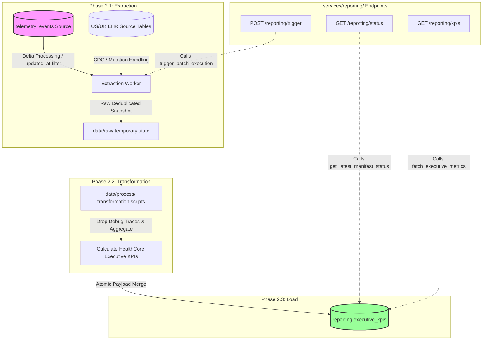

# HealthCore Business Performance Pipeline: Architecture & Design

## Part 1: Product & Business Context

### 1. Executive Purpose & Motivation
Up to this point, corporate performance reviews for HealthCore's executive leadership have relied on slow, manual assembly. Highly technical operations metrics were extracted from disparate clinic environments and painstakingly cross-referenced by hand to assemble a PDF brief at each scheduled corporate cadence window. This manual workflow introduced unacceptable operational friction, reduced overall data accuracy, and left the leadership team without a verifiable, auditable data lineage for strategic numbers.

The **Business Performance Data Pipeline** completely automates this operational loop. It bypasses engineering telemetry interfaces to feed a structured reporting architecture tailored specifically for high-level business planning.

### 2. Intended Audience & Cadence
* **Target Stakeholders:** Chief Executive Officer (Dr. Sandra Okonkwo), Clinical Operations Director (Dr. Marcus Reid), Patient Experience Manager (Priya Nair), and Revenue Cycle Manager (Tom Callahan).
* **Strategic Persona:** This audience does not evaluate server load factors, internal exceptions, or specific network latency regressions. They track system performance through a commercial lens—evaluating how operational changes alter user engagement, influence operational overhead, and impact general platform adoption.
* **Reporting Velocity:** Evaluated according to the strict reporting intervals defined by the company's business requirement: **Weekly delivery every Monday morning at 7:00 AM**. The target output demands consistent freshness and stable aggregation boundaries that map precisely to executive planning meetings.

### 3. Structural Alignment with Project Milestones

#### Phase 1: Contextualizing Our Current State
HealthCore successfully captures detailed engineering metrics across its 12 global clinics. However, these technical logs focus entirely on micro-level events: data volumes, errors, and system response latencies. This technical report provides high value to engineering squads debugging active deployments, but it fails to answer structural business health questions. The goal of this product expansion is to translate these raw, granular metrics into high-level business indicators.

#### Phase 2: Goal-Oriented Pipeline Design & Domain Integrity
This data pipeline is built backward from its final business goals. Every extraction parameter, payload structure, and transformation block in `data/process/` exists solely to calculate the exact KPIs demanded by company leadership. Technical operational events are synthesized directly into business-level indicators:

[ Raw Engineering Telemetry ] ──► [ Automated Transformation ] ──► [ Executive Business KPIs ]EHR Ingestion Events            - Granular Time Bucketing       - Patient No-Show Rates (Target: 22%)US/UK Billing Platform logs     - Regional Financial Mapping    - US Claims Denial Patterns (Target: 14%)Client API Extensions           - Operational Metric Blending   - Real-Time Cross-Border Revenue Streams

To maintain product integrity across the monorepo, this pipeline strictly rejects generic definitions. It enforces the explicit domain vocabulary, unique entity identifiers, and custom transactional concepts specified by HealthCore's operational model.

* **Patient Care Optimization:** Aggregates recurring appointment booking trends to spot product drop-off barriers, evaluate clinic utilization, and accurately target the network's costly **22% no-show rate**.
* **Cross-Border Billing Transparency:** Combines clinical activities with elective payload properties (such as billing codes and cost tracking variables added to the ingestion schema) to calculate actual operational expenses and compile real-time US and UK revenue streams.
* **Administrative Burden Reduction:** Evaluates clinical documentation times by location, allowing leadership to measure whether AI assistive tooling is successfully returning time back to patient care (aiming to reduce the current **35 minutes per day** administrative documentation load).

#### Phase 3: Operational Stability, Resilience & Audit Trust
Corporate-level decisions require stable, trustworthy data sources. This design treats data pipeline stability with the same rigor as live product features.

By building **Idempotency rules** providing concrete second-run guarantees after structural load failures, auditing system envelope identifiers (`event_id`), and designing data deduplication safeguards directly into the extraction stages, we ensure that unexpected server restarts, multi-run retries, or mutating historical source edits never corrupt executive charts or duplicate commercial financial numbers.

Furthermore, advanced observability hooks allow us to tell a quiet business day apart from a broken connection, and trace the lifecycle of a record step-by-step. If historical updates arrive late from user devices, the architecture integrates them automatically without breaking the historical audit trail or inflating published totals.

#### Phase 3.5: Fail-Safe Recovery and Client-Side Alignment
Executive analytics are backed by enterprise-grade infrastructure defenses. If a database cluster drops network traffic mid-pipeline, automated state checkpoint layers record progress milestones so execution can resume instantly without data reprocessing loops.

Additionally, client-side browser offline caches are treated as critical data buffers rather than vector gaps. The server ingestion edge actively monitors client memory thresholds and intercepts network failures, validating incoming streams and isolating structural clock-drift anomalies before they affect our corporate metric trends.

#### Cross-Cutting Systems Protection
To protect our corporate data warehouse from operational bottlenecks, our orchestration design embeds an active **Concurrency Guard Layer**. If an automated corporate timing cycle runs exactly when an engineer issues an emergency manual data trigger from the user control panel, the system systematically separates their access pathways.

By utilizing distributed lock leases, overlapping operations back away safely rather than triggering double-calculation charges, database race conditions, or transactional processing conflicts. This guarantees that corporate dashboards update smoothly even during irregular production workloads.

#### Phases 4 & 5: Production Orchestration & Application Integration
By embedding **Prefect core orchestration** (featuring 1 unified flow running 3 strictly mapped process tasks) and designing decoupled service access points, we guarantee that the pipeline transitions from a disconnected script to an enterprise-grade service asset. Business leaders can trust the reliability of their metrics because every run produces searchable runtime states (`Running`, `Completed`, `Failed`), runs on secure, block-managed database credentials, and isolates business metric generation completely from engineering-facing system processes.

---

## Part 2: Technical Specifications

### 1. Monorepo Directory Architecture
To enforce a strict separation of concerns, the engineering ecosystem divides code execution and storage across dedicated directories within the `data/` and `services/` paths. All HTTP infrastructure imports logic downwards; the data core remains independent.

📁 monorepo├── 📁 data/│   ├── 📁 raw/               # Temporary immutable raw extractions or landed schemas│   ├── 📁 process/           # Reusable data-transformation scripts and deterministic functions│   ├── 📁 pipelines/         # Orchestration scripts, run manifests, and state tracking│   │   ├── 📄 PIPELINE_DESIGN.md # [TARGET] HealthCore architectural design blueprint file│   │   └── 📄 run_pipeline.py    # Main execution entrypoint script│   └── 📁 eval/              # Data-validation constraints and accuracy metrics└── 📁 services/├── 📁 telemetry/         # [UNTOUCHED] Engineering telemetry collection & diagnostics│   └── 📄 analysis.py    # [DO NOT MODIFY] Legacy system metrics compiler└── 📁 reporting/         # [NEW] HealthCore Executive BI endpoints and serving layers
### 2. Core Guardrails & Boundary Isolations
* **Engineering Code Protection:** The files `services/telemetry/analysis.py` and the `GET /telemetry/report` endpoint are entirely read-only. No analytical framework or configuration belonging to this path will be modified.
* **Source & Destination Segregation:** The pipeline uses `telemetry_events` exclusively as an immutable source dataset. It is strictly forbidden to use `telemetry_events` as a destination.
* **Database Isolation:** All generated executive datasets must be committed to the dedicated reporting schema and written directly to the specific database table designated in the HealthCore context layout: `reporting.executive_kpis`. Under no circumstances should generic table targets like `reporting.business_metrics` be used.
* **Downstream Import Directives:** HTTP service routers located within `services/reporting/` are permitted to import pipeline execution tools and query engines from `data/pipelines/`. Reversing this paradigm (e.g., pipeline code attempting to import from an active web framework module) is strictly prohibited to keep data processing decoupled from the web-serving context.

### 3. Phase 1 — Current State Analysis

#### Current State Architectural Baseline
* **Telemetry Events Captured:** The system currently ingests live operational logs capturing runtime platform behavior, system errors, structural payloads, and transactional interaction indicators across HealthCore's 12 clinics.
* **Storage Layer Destination:** These raw telemetry traces are routed directly into the centralized `telemetry_events` table repository.
* **Existing Engineering Coverage:** The technical analytical path compiles system availability figures, tracks total request/event volumes, calculates system-wide error rates, and monitors service execution latencies. These metrics are processed by `services/telemetry/analysis.py` and exposed via the `GET /telemetry/report` endpoint exclusively for engineering debugging and service stability assessments.

#### Identification of the Strategic Gap
* **The Core Gap:** The existing telemetry stack entirely lacks the capability to derive high-level business indicators. It cannot aggregate multi-location activities into unified executive cadence snapshots, calculate cross-border financial dimensions (US commercial insurance vs. UK private pay/NHS contracts), or monitor product adoption rates.
* **Business Imperative:** To bridge this gap, a dedicated pipeline must be built. This pipeline will transform raw data traces into actionable strategic intelligence, answering the critical business question outlined in `CONTEXT-company.md` that standard engineering metrics cannot solve.

### 4. Phase 2 — Pipeline Design

#### Concrete Pipeline Purpose Statement
> **The purpose of this pipeline is to produce the automated data rollup that feeds the CEO (Dr. Sandra Okonkwo)'s executive performance report at a strict Weekly (Monday 7:00 AM) cadence, computing the core KPIs of Network Appointment Volume, Global No-Show Rate, Claims Denial Rate, Revenue by Location, and Patient Satisfaction scores derived directly from mandatory telemetry metrics mapped across both the US and UK electronic health record (EHR) platforms.**

#### Telemetry and Metric Consistency Mapping
The internal processing structures inside `data/process/` map one-to-one with the exact schemas configured in the HealthCore file context. No synthetic fields are inserted. The downstream analytics parse the incoming structural dimensions explicitly as follows:
* **Source Event Verification:** Processes mandatory incoming records from `telemetry_events` alongside HealthCore-specific transaction logs (`appointment_id`, `clinic_location_id`, `market_region`, `claim_status_code`, `satisfaction_score`).
* **Dimension Alignment:** Calculations preserve exact vocabulary mappings for user types, billing states, and functional action codes across both regions to protect analytical integrity.

#### Data Flow Diagram (Extraction, Transformation, Load)

#### Mutation & Record Update Strategy (Avoiding Duplicates)
* **The Problem:** The pipeline cannot assume that source tables are strictly append-only; certain clinic domain tables or mutated records (such as an appointment updated from `BOOKED` to `NO_SHOW` or `DISCHARGED`) receive updates rather than fresh insertions.
* **The Strategy:** To handle sources that update existing records, the extraction process evaluates record mutation timestamps (e.g., tracking a system `updated_at` high-water mark or standard Change Data Capture logs). 
* **Deduplication Method:** Before passing records to the transformation engine, the extraction stage ranks overlapping records by their mutation cadence utilizing a window function over the unique logical record keys (`ROW_NUMBER() OVER (PARTITION BY appointment_id, patient_id ORDER BY updated_at DESC)`). Only the latest state version is passed down into the pipeline, preventing stale, duplicate records from corrupting downstream aggregates.

### 5. Phase 3 — Resilience, Idempotency & Deep Observability

#### Ingestion Idempotency & Source Duplicates Strategy
* **Source Duplication Risk:** High-volume event-tracking nodes often emit duplicated actions into `telemetry_events` due to client-side network retries, connection timeouts, or distributed message broker redeliveries across regional paths.
* **Deduplication Key Layer:** To prevent counting the identical patient action multiple times within downstream business aggregates, deduplication is enforced at the **Extraction Layer** within `data/pipelines/`.
* **Envelope Field Selection:** The extraction queries isolate raw elements by enforcing a strict grouping on the global context unique identifier metadata envelope field—specifically the `event_id` column. Any duplicate rows containing an identical envelope identifier within the target processing window are dropped immediately during the extraction stage, ensuring only a single, true transaction enters the transformation functions in `data/process/`.

#### Load Failure Recovery & Explicit Second Run Guarantees
* **The Concrete Failure Scenario:** The pipeline logs an unexpected network drop mid-execution during the **Load Stage**. Half of the metrics for the targeted weekly execution window were successfully committed to `reporting.executive_kpis`, while the remaining arrays are unwritten.
* **Explicit Second Run Behavior:** When the automated scheduler or an on-call engineer triggers the second run, the system must not blindly append raw records, create partial calculations, or fail with constraint collisions.
* **Execution Logic:**
  1. The pipeline re-extracts and re-transforms the exact processing boundary parameters.
  2. The load query leverages atomic database operations (`INSERT ... ON CONFLICT (...) DO UPDATE SET ...`) keyed to a strict composite primary key (`reporting_window_timestamp` + `clinic_location_id`).
  3. Upon execution, the database detects that a subset of rows already exists from the failed execution attempt.
  4. Instead of appending duplicate lines or failing, the database updates the unvalidated entries with fresh, correct values and inserts the missing rows cleanly.
  5. This architecture guarantees that the second run naturally repairs historical gaps, leaving an uncorrupted destination state matching a perfect, single execution.

#### Late-Arriving Events Processing Strategy
* **The Challenge:** Events originating from clinical software or patient check-ins may be delayed by hours or days due to regional offline conditions or EHR sync lags. If processed incorrectly, re-running previous windows could inflate numbers or completely overwrite the audit log.
* **The Mechanism:** The extraction stage queries data using a dual-timestamp strategy: filtering on `created_at` (the actual time the patient encounter occurred) but checking against an `ingested_at` processing watermark (the time the event hit our main API gateway).
Audit Trail Preservation: When late events are found for a previously published historical day, the pipeline triggers a targeted re-computation flow for that specific snapshot window. Because it utilizes the atomic Upsert Pattern, the late rows are seamlessly calculated into the existing metric row for that day. Simultaneously, the pipeline's central execution log appends a brand new execution entry with a distinct run_id, recording that a historical correction occurred. This strategy guarantees precise, uninflated metric totals while maintaining a clear audit trail of past report states.Observability: Silence vs. True AbsenceMinimum Signals Logged: To isolate these states explicitly, the execution pipeline commits three structural baseline metrics into the execution metadata table on every run:source_heartbeat_status: A Boolean flag verifying that both the US and UK EHR source datastore connections are active and readable at the start of orchestration.extracted_raw_count: The explicit integer count of rows matched. If this returns 0 while source_heartbeat_status is verified as true, it confirms a True Absence of clinic activity (e.g., a regional holiday).pipeline_execution_state: An explicit state log showing whether the run reached a final terminal condition (COMPLETED or FAILED), differentiating completed quiet windows from dead or un-executed cron runs (Silence).Observability: Collection Traceability EngineTo trace data from raw ingestion to the final executive performance metrics, the pipeline captures specific auditing indicators to instantly identify data gaps, ingestion bursts, or processing interval drift:Lineage Tracking Field: The output reporting table records the specific pipeline_run_id that computed each metric row. This creates a direct link back to the exact execution configuration.Ingestion Lag Traces: The pipeline calculates and logs max_ingestion_lag_seconds (ingested_at minus created_at). Sudden spikes in this metric highlight upstream data bursts or clinical client processing delays.Interval Drift Traces: The orchestration monitor matches the actual pipeline start_time against its designated cron scheduler layout. Persistent positive offsets warn operators of script block bottlenecks or scheduling queue blockages before they delay morning executive reports.Observability: Growth vs. Data Loss ValidationThe Challenge: Real-world health metrics exhibit weekly volumetric shifts. Distinguishing true clinical volume drops from upstream processing failures or data loss requires an automated mathematical gatekeeper.The Solution: The data/eval/ module runs a statistical profiling task at the conclusion of the Transformation stage. It calculates a rolling median and Median Absolute Deviation (MAD) over a historical 14-day tracking window of the target business metrics.Volumetric Threshold Gates: If the current processing window's row count or KPI output drops or surges beyond 3 standard deviations (or custom MAD boundaries) compared to the rolling baseline, the pipeline flags the execution log with an ANOMALY_WARNING state parameter. This allows operators to differentiate organic operational growth from structural pipeline defects before exporting the numbers to Dr. Okonkwo's dashboard.6. Phase 3.5 — Advanced Recoverability ArchitectureDatabase Outage Checkpointing StrategyThe Problem: If the database connection drops mid-pipeline during execution, the system must avoid restarting the entire long-running extract-and-transform process across multi-regional datasets.The Solution: The orchestration engine records process snapshots into an out-of-band persistent atomic state tracking file located in data/pipelines/run_manifests/.State Checkpoints Persisted:PHASE_EXTRACTION_COMPLETE: Persisted immediately after data drops into data/raw/ along with the high-water mark timestamp.PHASE_TRANSFORMATION_COMPLETE: Persisted once the validation constraints inside data/eval/ pass successfully.Resumption Flow: When an automated cron or manual recovery worker retries a failed execution run, it reads the run’s matching manifest state file. If PHASE_EXTRACTION_COMPLETE is verified as true, the pipeline skips querying the live tables entirely, loads the serialized data arrays directly from the local data/raw/ storage layer, and proceeds to the Transformation phase.Frontend Buffer Ownership & Ingestion Layer DefensesThe Strategy: Buffering patient actions offline inside clinic client terminals during a regional internet disconnect is required to prevent data loss. However, this introduces client-side memory pressures, unvalidated schemas, and extreme client-side clock drift.Architectural Ownership: The frontend client owns the offline queue management (enforcing a strict FIFO max-buffer threshold of 500 records to prevent memory exhaustion). However, the Ingestion Gateway Validation Layer (the server hosting POST /telemetry) owns data validation and constraint enforcement under strict HIPAA/GDPR validation matrices.Clock Drift Correction: When clinic terminal buffers sync back online, the server explicitly computes the delta between the payload's original client timestamp and the server's incoming network arrival clock. If the client clock drifts beyond a tolerable window, the server re-anchors the event boundary to avoid corrupting historical day aggregates.Safe Transmission Retries on POST /telemetryIdempotency Strategy: Client-side communication retries must never cause duplicate event insertion within telemetry_events. Every ingest request must pass a unique deduplication token inside the request envelope or header (e.g., X-Idempotency-Key tracking the event's unique client-side UUID).Ingestion API Response Codes:201 Created: The token is entirely fresh; the event payload is validated, stored, and committed.200 OK (Already Stored): The ingestion server detects a token match within the deduplication cache. It bypasses the write pipeline completely and immediately echoes a successful 200 OK back to the terminal buffer to signal a clean queue flush, preventing downstream duplication.503 Service Unavailable / 429 Too Many Requests: Signals a retry condition. The client buffer intercepts this network status code and schedules an exponential backoff retry cycle.7. Cross-Cutting Engineering ConcernsConcurrent Runs, Overlaps, and Race Condition DefenseThe Risk Profile: Overlaps between automated weekly schedule timers (cron) and manual operator execution overrides from services/reporting/ create high-risk write conditions. If two pipeline tasks process and write to the identical destination window simultaneously, it causes data race conditions, partial table locked blocks, or dirty output combinations.Observation Strategy: The logging framework captures explicit operational telemetry for execution collisions. Prefect records specific runtime state trends, checking the global concurrency manager database before launching tasks. If a conflict occurs, it registers an EXECUTION_OVERLAP_SIGNAL metric containing the active block configurations.Race Condition Mitigation: To enforce absolute data protection, the orchestration engine locks execution through a Distributed Database Advisory Lock attached to the targeted execution date parameter (PARTITION_LOCK_KEY = hash(window_start + window_end)).The secondary workflow attempts to acquire this processing lease.If the primary cron run is still active, the secondary manual run immediately backs off, avoiding dirty writes or duplicate resource contention.Overlapping Recovery Flow: When a collision is registered, the manual request does not fail blindly or terminate destructively. Instead, it enters a structured Queued Wait State with an exponential backoff poll loop (checking every 30 seconds for a maximum of 5 cycles). If the active run finishes cleanly within that limit, the queued run scans the updated target table state. If it discovers the necessary targets are already written and validated by the prior worker, it steps down gracefully with a 200 OK (State Verified) response, avoiding duplicate resource utilization.Mandatory Production Audit Log FieldsTo provide an unalterable operational audit trail, every single pipeline run commits a structured record to the metadata logging layer. The 5 mandatory fields and their audit necessities are configured below:Field NameData TypeAudit Purpose & Production Necessitystart_timeTIMESTAMPEstablishes the exact execution baseline. Used to cross-reference pipeline lag against the time data actually landed in source tables.end_timeTIMESTAMPMeasures processing runtime performance when paired with start_time. Crucial for SLA tracking and bottleneck identification.records_processedINTEGERProvides a volumetric integrity check. Allows operators to verify that extracted source volume logically correlates with historical trends.statusVARCHARExplicitly denotes processing states (RUNNING, COMPLETED, FAILED). Serves as the primary operational trigger for alerting systems.errorsTEXT / JSONCaptures structural stack traces, timeout logs, or data validation failures. Essential for rapid engineering diagnosis during a post-mortem.8. Phase 4 — Mapping to Prefect OrchestrationThe pipeline design explicitly maps to modern data orchestration paradigms via Prefect. Execution state blocks, task separation, and runtime environments are configured as follows:Flows and Tasks TaxonomyMain Flow (1 Required): healthcore_business_performance_pipeline_flowRepresents the complete root execution entrypoint for the weekly business cadence compilation. It manages context distribution, orchestrates sequential tasks, and catches untracked failures.Mandatory Tasks (3 Aligned Tasks Required):extract_telemetry_source_task: Connects to telemetry_events, enforces envelope deduplication based on event_id, isolates delta ranges via high-water marks, and dumps structured arrays into data/raw/.transform_business_kpis_task: Imports functional modules from data/process/, maps HealthCore domain values, calculates executive KPIs (No-shows, Denials, revenue), and validates computed matrices against the target boundaries.load_reporting_destination_task: Establishes connections to the destination instance, executes atomic UPSERT commands matching the data constraints, and populates reporting.executive_kpis.Monitored Runtime StatesRunning: Assigned immediately upon flow launch. Locks concurrent executions on identical time blocks to eliminate cross-process friction.Completed: Set only when the load task finishes writing. Signals downstream applications that new data points are safe to render on Dr. Okonkwo's dashboard.Failed: Triggered if any sub-task throws an uncaught error. Immediately captures state details, dumps operational parameters to the execution log, and notifies internal alerting channels.Infrastructure Configuration BlocksPrefect Blocks Isolation: Credentials and sensitive connection parameters are stored outside the codebase using managed Prefect Blocks.Target Datastore Blocks: Database credentials, hostname parameters, and SSL cert configs required to access the source and write to the target are contained in a unified SqlAlchemyConnector block or a dedicated SupabaseCredentialsBlock, ensuring zero secrets land in plain text inside the monorepo.9. Phase 5 — Application Integration & Planned EndpointsThe service routes inside services/reporting/ act strictly as thin delivery web-controllers. All computational heavy-lifting, validation profiling, and database connection logic are imported downward from targeted modules within data/pipelines/ to prevent intermixing web contexts with data workflows.GET /reporting/status (Status Query)Function Imported: from data.pipelines.status_checker import get_latest_manifest_statusFunctional Behavior: Triggers an isolated database scan over the central audit tables and returns a JSON payload detailing the operational health, processed record volume, structural error strings, and completion status of the most recent pipeline runs.POST /reporting/trigger (Manual Trigger)Function Imported: from data.pipelines.run_pipeline import trigger_batch_executionFunctional Behavior: Authenticates the administrative request and spawns an asynchronous execution block of the root Prefect flow (healthcore_business_performance_pipeline_flow) over the user-provided window parameters, enabling immediate disaster recovery or custom historical backfills.GET /reporting/kpis (KPI Query for Dashboard)Function Imported: from data.pipelines.query_interface import fetch_executive_metricsFunctional Behavior: Executes a direct read-optimized query against reporting.executive_kpis. It transforms the aggregated row structures into clean, low-latency JSON streams built explicitly to power frontend executive charts, management metrics grids, and presentation dashboards for HealthCore leadership.